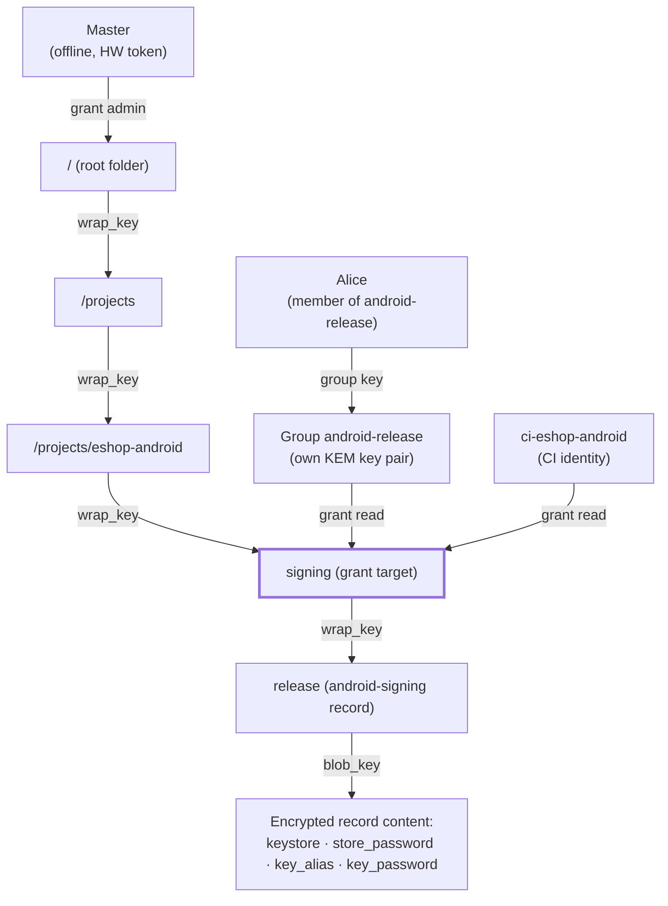

# nepomuk – Specification v0.1

Status: draft · 2026-09-30

## Contents

1. [Introduction and goals](#1-introduction-and-goals)
2. [Security principles and threat model](#2-security-principles-and-threat-model)
3. [Cryptography](#3-cryptography)
4. [Identities and authentication](#4-identities-and-authentication)
5. [Permission model](#5-permission-model)
6. [Key hierarchy](#6-key-hierarchy)
7. [File format](#7-file-format)
8. [Operations and their authorization](#8-operations-and-their-authorization)
9. [Git integration](#9-git-integration)
10. [CLI](#10-cli)
11. [Records, templates and `nepomuk exec`](#11-records-templates-and-nepomuk-exec)
12. [JSON API and `serve --stdio`](#12-json-api-and-serve---stdio)
13. [GUI](#13-gui)
14. [Example: signing an Android app](#14-example-signing-an-android-app)
15. [Operations guide](#15-operations-guide)
16. [MVP scope, roadmap and open questions](#16-mvp-scope-roadmap-and-open-questions)

---

## 1. Introduction and goals

nepomuk is a company-wide secrets vault stored as a single file in git, with permissions enforced by cryptography and post-quantum encryption. It holds passwords, certificates and binary files in a folder tree; every user can read only what they hold a key for.

**Goals**

- One vault for the whole company (hundreds of users, hundreds of secrets) in its own git repository, shared into projects as a submodule.
- Permissions on folders and individual secrets, inherited down the tree, with groups and delegated administration.
- Identity by email + password (per NIST SP 800-63B-4) or by a post-quantum SSH key `mldsa44-ed25519`.
- Hybrid post-quantum cryptography; the file in git history must withstand a future quantum adversary.
- Knowing the design or the source code must not weaken security.
- Primary use case: CI signs applications (e.g. an Android JKS) with keys from the vault without developers ever seeing them.

**Components**

- `nepomuk` CLI in Rust – the only place containing security logic; Linux, Windows, macOS.
- nepomuk GUI in Tauri – only calls the CLI (`nepomuk serve --stdio`) and contains no cryptography.

**Out of scope**: a server, SSO login, auditing of reads (reads happen offline), managing secrets outside the vault.

## 2. Security principles and threat model

The vault file is public to anyone with access to the repository, and an attacker can write their own client. Therefore no permission may rely on a check performed by the program.

**Principles**

1. **Kerckhoffs's principle** – design, format and code are public; only keys are secret.
2. **Read = holding a key.** Without the wrapped node key the content cannot be decrypted by any code.
3. **Write and administration = a valid signature by an authorized identity.** On load, every client verifies that each change was signed by someone who held the right to make it at that moment; otherwise the file is rejected.
4. **Hybrid cryptography** – a post-quantum and a classical algorithm at the same time; an attacker has to break both.
5. **Root of trust outside the file** – the fingerprint of the master key is pinned locally or in CI configuration.
6. **Metadata minimization** – names of secrets and folders are encrypted, sizes are padded.

**Threat model**

| Attacker | Capability | Defense |
| --- | --- | --- |
| Anyone with a copy of the file | read it, crack passwords offline | encryption, Argon2id, NIST password rules |
| Attacker with push access to the repo | forge, delete or roll back the file | signatures, root of trust, rollback protection |
| User with limited rights | custom client, bypassing the CLI | cryptographic enforcement of rights |
| Revoked user | old keys, git history | subtree rekey, rotating secrets at the source |
| Future quantum computer | "harvest now, decrypt later" on git history | ML-KEM-1024, 256-bit symmetric keys |
| Compromised CI | reading the CI identity's secrets | narrow rights, protected environment, revocation |

**Visible in the file without keys**: the list of users (names, emails, public keys), group names, tree shape (number of nodes and parent–child links, without names), who holds a grant on which node (by ID), padded sizes, timestamps and authors of changes.

**Not enforceable**: who has read a secret (reads are offline) and what an authorized user copied. Compromise of the master key means compromise of the whole vault.

## 3. Cryptography

nepomuk uses one fixed algorithm suite `NPQ-1`; its ID is in the file header so the suite can be replaced in the future without changing the format. No algorithm negotiation, no optional weaker variants.

| Purpose | Algorithm | Note |
| --- | --- | --- |
| Key encapsulation for recipients (KEM) | ML-KEM-1024 (FIPS 203) + X25519 | hybrid; highest ML-KEM level because of git history |
| Signatures of identities and changes | ML-DSA-65 (FIPS 204) + Ed25519 | both parts must verify |
| Binding to an SSH identity | `mldsa44-ed25519` (OpenSSH 10.4+, SSHSIG) | identity only, see §4 |
| Symmetric encryption | XChaCha20-Poly1305 | 256-bit key, random 192-bit nonce |
| Password-based key derivation | Argon2id | default 256 MiB, t = 3, p = 1, 128-bit salt |
| Hashing, key derivation | SHA3-256, HKDF-SHA3-256 | domain-separated labels |
| Randomness | OS CSPRNG (`getrandom`) | no custom generator |

**Hybrid KEM (X-Wing-style combiner)**

```
(ct_pq, ss_pq)  = ML-KEM-1024.Encaps(pk_pq)
(eph, ss_ec)    = X25519(ephemeral_sk, pk_ec)
KEK = HKDF-SHA3-256(ikm  = ss_pq || ss_ec,
                    salt = ct_pq || eph || pk_pq_hash || pk_ec,
                    info = "nepomuk/NPQ-1/kem")
wrapped = XChaCha20-Poly1305(KEK, nonce, key, aad = vault_id || target || recipient)
```

The AAD binds a wrapped key to a specific vault, node and recipient, so it cannot be transplanted elsewhere.

**Hybrid signature**: `sig = ML-DSA-65.Sign(m) || Ed25519.Sign(m)`, where `m = SHA3-256("nepomuk/NPQ-1/<type>" || data)`. Verification requires both parts to be valid.

**Identity keys** are derived from a single random 64-byte seed via HKDF (separately for ML-KEM, X25519, ML-DSA, Ed25519). Only the encrypted seed is stored.

**Size padding**: plaintext is padded before encryption to the next power of two (minimum 256 B; above 64 KiB to multiples of 64 KiB).

**Libraries** (Rust): `libcrux-ml-kem` and `libcrux-ml-dsa` (formally verified implementations), `x25519-dalek`, `ed25519-dalek`, `chacha20poly1305`, `argon2`, `sha3`, `hkdf`, `zeroize`. No custom cryptographic primitives are written.

**Memory hygiene**: secret keys in `zeroize` types, pages locked against swapping (`mlock` / `VirtualLock`), core dumps disabled for the process.

## 4. Identities and authentication

Every user has a nepomuk identity: a hybrid key pair for encryption (ML-KEM-1024 + X25519) and for signatures (ML-DSA-65 + Ed25519). Identity types differ only in where the seed is stored and how it is unlocked.

| Type | Where the seed lives | Unlocked by | Binding |
| --- | --- | --- | --- |
| Email + password | in the vault, in the user record | Argon2id(password) | the email is only an identifier |
| PQ SSH | locally, `~/.config/nepomuk/identity.npk` | file passphrase (Argon2id) | public keys signed with an `mldsa44-ed25519` SSH key |
| Master | locally or on a hardware token | passphrase / token | fingerprint pinned by clients |

### 4.1 Password (NIST SP 800-63B-4)

- Minimum length **15 characters** (the password is the only factor), maximum 1024.
- All printable ASCII characters, space and Unicode allowed; **NFC** normalization before hashing.
- **No composition rules** (upper case, digits, special characters).
- **Blocklist**: a built-in list of the most common breached passwords + context-specific words (the email and its parts, the name, "nepomuk", the vault name). Optional check against Have I Been Pwned (k-anonymity), off by default.
- Passwords are never truncated; no hints or security questions; pasting from password managers is allowed.
- No mandatory periodic change; a change can be forced with a flag on suspected compromise.
- **Deviation from NIST**: rate limiting of attempts is impossible because the file can be attacked offline. It is replaced by an expensive Argon2id (parameters stored per user, automatically strengthened on next login) and by a passphrase generator `nepomuk passgen` (6 words, ~77 bits).
- Password strength estimation (zxcvbn) only as a warning, not a block.

### 4.2 PQ SSH identity

- **Only** the `mldsa44-ed25519` type (OpenSSH 10.4+) is accepted. Other types (ed25519, rsa, ecdsa) are rejected.
- An SSH key is a signing key, not an encryption key; the user therefore generates a local nepomuk identity and signs its public keys with the SSH key (`ssh-keygen -Y sign -n nepomuk`, works through ssh-agent as well).
- The binding signature (SSHSIG) is stored in the user record for auditing.
- Risk: `mldsa44-ed25519` support in OpenSSH is experimental and based on a draft; if the format changes, keys will have to be regenerated and bindings renewed. nepomuk stores the exact algorithm identifier.

### 4.3 Enrollment

1. The user creates a request locally: `nepomuk identity request --email …` (password) or `--ssh-key …` (SSH). Keys and password stay with the user.
2. The request (public keys; for passwords the encrypted seed; for SSH the binding signature) is sent to an administrator.
3. The master or someone with the `users` right verifies it and signs an `AddUser` operation.

Neither the master nor an administrator ever learns the user's password or private key.

### 4.4 Recovery and change

- **Changing a password or passphrase** re-encrypts only the seed; keys and grants stay the same.
- **Forgotten password / lost key**: users cannot recover anything themselves. They submit a new request, an administrator approves it as a replacement of the old identity (inheriting groups), and admins who hold the keys re-issue the grants. The old identity is revoked.

## 5. Permission model

The master can do everything, including reading the whole vault. Other users can do only what they have been granted, and nobody can grant more than they hold.

### 5.1 Tree rights

| Right | Allows |
| --- | --- |
| `read` | read secrets and names in the subtree |
| `write` | create, modify and delete in the subtree (includes `read`) |
| `share` | grant `read` and `write` within the own subtree, up to the own level |
| `admin` | all of the above + grant `share` and `admin`, revoke rights, rekey |

Rights are inherited down the tree and can be granted to a user or a group, on a folder or on an individual secret. Effective right = the maximum over all grants on the node and its ancestors, direct or via groups.

### 5.2 System rights

| Right | Allows | Needs data keys |
| --- | --- | --- |
| `users` | create, disable, offboard users, approve identities | no |
| `groups` | create groups | no |
| `group-admin` (per group) | change membership of that group | yes – must be a member |
| `audit` | read the full log of changes and grants | no (names only where it has `read`) |

Every system right may carry a `+delegate` flag – its holder may grant it to others.

### 5.3 Groups

- A group has its own hybrid KEM key pair; its private key is wrapped for each member.
- Adding a member = wrapping the group key for them; no data is re-encrypted.
- Removing a member = a new group key + rekey of all nodes the group had access to (§8).
- Whoever manages membership must hold the group key and therefore sees everything the group can access. `group-admin` can only be granted to a member.
- Group nesting is limited to depth 2.
- Group names are public.

### 5.4 Rules

- **No escalation**: one can grant only a right ≤ one's own and only within one's own subtree.
- **The master** implicitly holds all rights, which cannot be removed. There is exactly one master; transferring it to another identity is a special operation signed by the old master, and clients must confirm the change of the pinned fingerprint.
- **Rekey of a node** can only be performed by a holder of the parent's key (admin of the parent folder or the master), because the new key is wrapped under the parent's key.
- **Verification**: rights are evaluated by every client over the log at the moment of each operation; an unauthorized operation invalidates the whole file.

## 6. Key hierarchy

Every tree node (folder or secret) has its own random 256-bit node key (NK). A parent's key unlocks its children's keys, so a grant on a folder automatically covers its entire subtree.



Alice and the CI identity only hold a grant on `signing`; from its key they derive `wrap_key`, unwrap the key of the `release` record, and its `blob_key` decrypts the fields. They cannot see the names of parent folders.

**Keys derived from NK** (HKDF-SHA3-256):

- `blob_key` – encrypts the node content: name, type, metadata and, for secrets, the data (text, binary content, record fields).
- `wrap_key` – wraps the keys of direct children; AAD = `vault_id || child_id`.

**Grants**: a grant = the node key wrapped with the hybrid KEM for a recipient (user or group). The wrapped grant payload:

```
{ node_key, path: "/projects/eshop-android/signing", right: "read" }
```

The path is stored encrypted inside the grant so that a user with a right only on a deep node knows where it lives without being able to decrypt the names of the parent folders. When an ancestor is renamed, grants in the subtree are re-wrapped.

**Groups**: a grant for a group is wrapped with the group's public KEM key; a member first decrypts the group key (wrapped for them), then the grant.

**Root**: the root folder `/` has no parent; its NK is wrapped only by a grant for the master.

**Path to a secret when reading**: identity → (group key) → grant → NK of the grant's node → `wrap_key` → NK of the child → … → `blob_key` of the target secret. nepomuk decrypts only this path, not the whole vault.

**Consequence**: `write` on a folder without `read` does not exist, because writing a new node requires the parent's key.

## 7. File format

The file `vault.nepomuk` is a signed snapshot (checkpoint) followed by a chain of signed commits that are only ever appended. The client deterministically reconstructs the state from it and verifies the author's permissions at each step.

```
[header]     magic "NEPOMUK" | format version | suite "NPQ-1" | vault_id (128 bit)
[checkpoint] seq | state (users, groups, nodes, grants, rights) | master signature
[commit 1]   seq | prev_hash | author | time | operations[] | author signature
[commit 2]   …
```

- **Serialization**: deterministic CBOR (RFC 8949, core deterministic encoding). The stored bytes are signed, not a re-serialized structure.
- **Chain**: `prev_hash` = SHA3-256 of the previous commit or checkpoint. The vault head = the last entry.
- **Append-only**: a new commit is only appended at the end, so git stores small deltas and the repository history does not grow by the whole file.
- **Size estimate**: a user's public keys ≈ 3.6 KB, a grant ≈ 1.7 KB, a commit signature ≈ 3.4 KB. Single-digit MB for hundreds of users and secrets.

### 7.1 Root of trust

- Master key fingerprint = SHA3-256 of its public keys, displayed as `npk1…` (bech32).
- The client knows it from a local pin (`nepomuk trust`, automatic on `init`), from the `NEPOMUK_ROOT_FP` variable (CI), or as a default from `.nepomuk.toml`, which it pins on first use and rejects any later change.
- Without a pin nepomuk does not open the file.

### 7.2 Rollback protection

- For each `vault_id` the client remembers the highest seen `seq` and head hash (`~/.local/state/nepomuk/`).
- Lower `seq` → `ROLLBACK_DETECTED` error. Same `seq` with a different commit hash → `FORK_DETECTED`.
- In CI without local memory, the version in the commit pinned by the submodule serves as the lower bound (§9).

### 7.3 Compact

- `nepomuk compact` (master only) folds the log into a new checkpoint with the same `seq` as the last commit.
- A client accepts a checkpoint with `seq` ≥ the remembered one if it is signed by the master.
- Compact does not erase git history; old versions of the file remain in the repository.

### 7.4 Verification cache

Verifying the whole log is expensive (thousands of ML-DSA signatures). The client stores the verified state and head hash locally and next time verifies only new commits. The cache is only an optimization – `nepomuk verify --full` ignores it.

## 8. Operations and their authorization

Each commit carries one or more operations applied atomically. The client verifies every operation against the state before it.

| Operation | Required right of the author |
| --- | --- |
| `AddUser`, `DisableUser`, `ReplaceIdentity` | master or `users` |
| `UpdateOwnCredential` (password change, Argon2id parameters) | the user themselves |
| `CreateGroup` | master or `groups` |
| `AddMember`, `RemoveMember` | master or `group-admin` of the group |
| `CreateNode` | `write` on the parent |
| `UpdateNode` (content) | `write` on the node |
| `RenameNode`, `DeleteNode` | `write` on the parent |
| `Grant read/write` | `share` on the node, not above the own right |
| `Grant share/admin`, `Revoke` | `admin` on the node |
| `Rekey` (new NK for a subtree) | `admin` on the node's parent or master |
| `GrantSystemRight` | the same right with `+delegate`, or master |
| `MarkRotation`, `ClearRotation` | `write` on the node |
| `TransferMaster`, `Checkpoint` | master |

### 8.1 Revocation and rekey

1. `Revoke` removes the grant.
2. A `Rekey` of the affected subtree follows automatically: new NKs for the node and all descendants, re-encrypted content, keys re-wrapped under the parent, and new grants for all remaining recipients in the subtree.
3. Both are in one commit; revocation without rekey is only possible with `--no-rekey` and a warning.
4. nepomuk lists the secrets the revoked party had access to and marks them "pending rotation".

Rekey protects only future content. Anything the revoked party has already seen must be changed at the source (new certificate, new database password, upload key reset in Google Play).

### 8.2 Offboarding

`nepomuk user offboard alice` in a single commit:

- disables the identity,
- removes it from all groups (new group keys),
- revokes its direct grants,
- rekeys all affected subtrees,
- marks secrets for rotation and lists them (the GUI turns them into a checklist).

If the author does not hold keys to all affected nodes (e.g. has only `users`), offboarding disables the identity, removes the memberships and grants it is able to remove, and returns the rest (rekey) as tasks for the admins of the respective folders. A disabled identity cannot sign any further change, effective immediately.

## 9. Git integration

The company vault has its own repository, included in projects as a submodule. nepomuk calls the system `git` (the user's authentication, hooks and configuration keep working), always reads the current `origin/main` and pushes automatically after every write.

### 9.1 Reading

- `git fetch` in the submodule directory, then `git show origin/main:vault.nepomuk`.
- The submodule checkout is not modified; the submodule pointer in the project is not the source of the version.
- Offline: reads come from the last fetched version with a warning about its age.

### 9.2 Writing with automatic push

1. `fetch` and verification of the current state.
2. Creating and signing a commit in the vault log.
3. A git commit directly on top of `origin/main` via plumbing (`hash-object`, `mktree`, `commit-tree`), without checkout, so the detached HEAD of the submodule does not matter.
4. `git push origin <commit>:refs/heads/main`.
5. Push rejected → automatic `sync` and a new attempt, at most 5×, then `SYNC_CONTENTION`.
6. The operation is complete only after a successful push.

Offline, writes fail (`OFFLINE`). As an emergency option, `--offline`: a local commit and a persistent "not pushed" warning until the next `sync`.

**Git commit messages** must not reveal anything: `nepomuk: #42 by alice (3 operations)`, no paths or names.

### 9.3 Sync (rebase at the nepomuk level)

1. Fetches and verifies the remote version.
2. Replays its own unpushed operations on top of the new state as **intent** ("store X", "give Bob read"), not as the original ciphertext – a rekey may have happened in the meantime.
3. Re-verifies permissions and re-signs the operations (requires an unlocked identity).
4. Reports conflicts, never silently overwrites:
    - target folder deleted → the operation fails,
    - the same secret changed by both → the user chooses a version,
    - grant on a deleted node → dropped with a warning.

### 9.4 `.gitattributes` in the vault repository

```
vault.nepomuk binary diff=nepomuk merge=nepomuk
```

- `diff=nepomuk` (textconv) shows only public metadata in `git diff` and `git log -p`: seq, author, operation types, signature validity.
- `merge=nepomuk` only refuses to merge and prints "use `nepomuk sync`".

### 9.5 Submodule pin as a safeguard in CI

A CI runner has no local memory of versions. In CI (`--ci` or environment detection) nepomuk verifies that `origin/main` has `seq` ≥ the version in the commit the submodule points to, and that the pinned head is an ancestor of the current one (after `compact` comparing `seq` is enough). An attacker with access only to the vault repository therefore cannot feed CI an older version.

### 9.6 Git history

History keeps all old versions of the vault and is not erased. That is why secrets must be rotated at the source after revocation, and why post-quantum encryption is used. nepomuk does not rely on git commit signatures.

## 10. CLI

`nepomuk` is a single static binary for Linux, Windows and macOS. Every command supports `--json`, and in that mode it never prompts on a TTY.

| Area | Commands |
| --- | --- |
| Vault | `init`, `trust`, `info`, `status`, `verify [--full]`, `log`, `compact`, `sync` |
| Identity | `identity new`, `identity request`, `identity passwd`, `passgen` |
| Users | `user add <request>`, `user list`, `user disable`, `user offboard`, `user replace` |
| Groups | `group create`, `group add`, `group remove`, `group list` |
| Tree | `ls [-r]`, `mkdir`, `put`, `get`, `mv`, `rm`, `rotation list`, `rotation done` |
| Rights | `grant <who> <right> <path>`, `revoke`, `access <path>`, `whoami`, `sysgrant`, `sysrevoke` |
| Running | `exec <profile> -- <command>` |
| GUI | `serve --stdio`, `version --json` |
| Master management | `master backup --shares 5 --threshold 3`, `master restore`, `master transfer` |

### 10.1 Passing passwords and secrets

- **Never in command arguments** (visible in `ps` and task managers).
- Password or passphrase: hidden from the TTY, `--password-fd N`, or `--password-stdin`. The variables `NEPOMUK_PASSWORD` / `NEPOMUK_PASSPHRASE` are for CI only, with a warning in the documentation.
- Identity in CI: `NEPOMUK_IDENTITY` (identity file content, base64) or `--identity <file>`.
- `put`: content from stdin, `@file` or `--field-prompt`. `get`: to stdout or `--out` with `0600` permissions.

### 10.2 Configuration

**Project** – `.nepomuk.toml` in the root of the application repository:

```toml
vault      = "secrets/vault.nepomuk"   # file in the submodule
remote_ref = "origin/main"
prefix     = "/projects/eshop-android" # relative paths
root_fp    = "npk1…"                   # default only; the local pin takes precedence

[exec.android-release]
# see §11
```

**User** – `~/.config/nepomuk/config.toml`: path to the identity, default email, session timeout, HIBP check.

**State** – `~/.local/state/nepomuk/` (Windows `%LOCALAPPDATA%`, macOS `~/Library/Application Support`): root pins, highest `seq`, verification cache.

### 10.3 Exit codes

`0` success · `1` general error · `2` usage error · `3` access denied · `4` vault verification failed (signature, rollback, fork) · `5` network / git · `6` conflict · `7` input required (password) · for `exec`, the exit code of the child process.

## 11. Records, templates and `nepomuk exec`

Secrets that belong together (keystore, alias, passwords) form one record with fields and change in one operation. `nepomuk exec` hands them to the build tool only for the duration of its run.

### 11.1 Secret types

| Type | Content | Field addressing |
| --- | --- | --- |
| `text` | a single string (password, token) | `path` |
| `binary` | a file (JKS, P12, PEM) + MIME type | `path` |
| `record` | named fields, each text or binary | `path#field` |

### 11.2 Record templates

A template defines required fields and validation on save. In the MVP:

- `android-signing` – `keystore` (binary), `store_password`, `key_alias`, `key_password`. Validation via `keytool` (if available): the keystore opens with the password and the alias exists. Stores the certificate validity.
- `pkcs12-cert` – `bundle` (binary), `password`. Validation that it opens, stores validity.
- `generic` – arbitrary fields.

From the stored validity, `ls` and the GUI warn about expiry (30 days ahead by default). The GUI renders a form from the template.

### 11.3 Profiles in `.nepomuk.toml`

```toml
[exec.android-release]
file.ANDROID_KEYSTORE      = "signing/release#keystore"
env.ANDROID_STORE_PASSWORD = "signing/release#store_password"
env.ANDROID_KEY_ALIAS      = "signing/release#key_alias"
env.ANDROID_KEY_PASSWORD   = "signing/release#key_password"
```

- `env.X` – the value goes into an environment variable of the child process.
- `file.X` – the content goes into a temporary file, its path into variable `X`.
- A profile contains only paths, not secrets; changing it gives nobody more than their identity's keys allow.

### 11.4 Behavior of `nepomuk exec <profile> -- <command>`

1. Verifies the vault (signatures, root of trust, rollback, submodule pin in CI).
2. Decrypts only the fields in the profile; missing access → `ACCESS_DENIED`, the command is not started.
3. Creates files per platform:
    - Linux: `memfd`, never written to disk, path `/proc/self/fd/N`,
    - macOS: private directory `0700`, file `0600`,
    - Windows: a temporary file with an ACL for the current user only, `FILE_ATTRIBUTE_TEMPORARY`.
4. Starts the command with variables only for it; they never reach the shell or other CI steps.
5. Filters stdout and stderr of the process, replacing secret values with `***` (by default in CI, otherwise `--mask`). On GitHub Actions it additionally emits `::add-mask::`.
6. Forwards signals (Ctrl+C, SIGTERM) and passes the exit code through.
7. After the run it overwrites and deletes the files, even if the build fails. Leftovers from a crash of nepomuk itself are cleaned up on the next run.

**Limits**: environment variables can be read by another process of the same user; masking stops only accidental printing, not deliberate exfiltration (e.g. base64). Narrow CI identity rights and a protected pipeline environment protect against that.

## 12. JSON API and `serve --stdio`

The GUI and scripts work only with machine-readable output with a versioned schema; text meant for humans is never parsed.

### 12.1 `--json` output

```json
{ "api": 1, "ok": true, "data": { … } }
{ "api": 1, "ok": false,
  "error": { "code": "ACCESS_DENIED", "message": "…", "details": { "path": "/prod" } } }
```

**Error codes (MVP)**: `ACCESS_DENIED`, `NOT_FOUND`, `ALREADY_EXISTS`, `PASSWORD_REQUIRED`, `BAD_CREDENTIALS`, `WEAK_PASSWORD`, `IDENTITY_DISABLED`, `UNTRUSTED_ROOT`, `SIGNATURE_INVALID`, `UNAUTHORIZED_OPERATION`, `ROLLBACK_DETECTED`, `FORK_DETECTED`, `STALE_BELOW_PIN`, `OFFLINE`, `SYNC_CONTENTION`, `CONFLICT`, `UNSUPPORTED_SSH_KEY`, `UNSUPPORTED_FORMAT`, `TEMPLATE_VALIDATION`, `GIT_ERROR`.

### 12.2 `nepomuk serve --stdio`

A long-running process started by the GUI; JSON-RPC 2.0 over stdin and stdout, one message per line.

- Solves the unlock cost: Argon2id (~1 s, 256 MiB) runs once per session, not on every click.
- Only this process holds the unlocked identity, in locked memory; the GUI forgets the password once it is handed over.
- Forgets the identity after inactivity (default 10 min), on a `lock` request, and when the screen is locked (signal from the GUI).
- Opens no socket or port; exits when stdin is closed.
- Methods correspond to CLI commands: `vault.status`, `node.list`, `node.get`, `node.put`, `grant.add`, `user.offboard`, `sync.run`, `session.unlock`, `session.lock` …
- Asynchronous events (notifications): `sync.progress`, `vault.changed`, `session.expired`.
- Returns secrets only on an explicit `node.get`; `node.list` returns metadata only.

### 12.3 Compatibility

`nepomuk version --json` returns the CLI version, the JSON API version and the supported file-format versions and crypto suites. The GUI refuses to work with an incompatible CLI. A backward-incompatible schema change increments `api`.

## 13. GUI

nepomuk GUI is a Tauri application for Linux, Windows and macOS that can do everything the CLI can, but does all work through the bundled CLI binary (sidecar) in `serve --stdio` mode.

**Architecture**

- Web UI ↔ Tauri Rust backend ↔ `nepomuk serve --stdio` process.
- The Tauri backend only translates messages; it has no cryptography and no access to keys.
- The web layer has no access to the file system or network (restrictive CSP, only explicit Tauri commands allowed).
- CLI and GUI are released together and signed (Apple notarization, Authenticode, package signatures on Linux).

**Features**

- Opening a vault from a repository or project (via `.nepomuk.toml`), pinning the root of trust with a visible fingerprint.
- Login with a password or local identity; enrollment with a passphrase generator and NIST checks.
- Secret tree, detail view, template-based forms, certificate expiry warnings.
- Management of users, groups and rights; views "who has access to this folder" and "what this user has access to".
- Offboarding with a checklist of secrets to rotate.
- Sync status (up to date / behind / ahead / conflict), a Sync button, a conflict resolution dialog.
- Audit log of changes (with the `audit` right).
- Running an `exec` profile for a local release build.

**GUI obligations**

- Clears the clipboard 30 s after copying a secret (configurable); on macOS and Windows marks the content as excluded from clipboard history.
- Never writes secrets to logs, caches or window state; values are hidden until the user reveals them.
- Saves binary files only through the system dialog.
- Sends `session.lock` when the screen locks and after inactivity.

## 14. Example: signing an Android app

CI signs the release build with the upload key from the vault; developers never see the keystore or the passwords. The commands show the proposed interface.

**1. Storing** (tech lead with `admin` on `/projects/eshop-android`)

```bash
nepomuk mkdir /projects/eshop-android/signing
nepomuk put /projects/eshop-android/signing/release \
  --template android-signing \
  --field keystore=@release.jks \
  --field key_alias=eshop-upload \
  --field-prompt store_password --field-prompt key_password
```

**2. Permissions**

```bash
nepomuk grant group:android-release read /projects/eshop-android/signing
nepomuk grant user:ci-eshop-android read /projects/eshop-android/signing
```

**3. Profile** in the application's `.nepomuk.toml` – see §11.3.

**4. Gradle** (`app/build.gradle.kts`) reads only environment variables:

```kotlin
android {
    signingConfigs {
        create("release") {
            val ks = System.getenv("ANDROID_KEYSTORE")
            if (ks != null) {
                storeFile     = file(ks)
                storePassword = System.getenv("ANDROID_STORE_PASSWORD")
                keyAlias      = System.getenv("ANDROID_KEY_ALIAS")
                keyPassword   = System.getenv("ANDROID_KEY_PASSWORD")
            }
        }
    }
    buildTypes { getByName("release") { signingConfig = signingConfigs.getByName("release") } }
}
```

**5. CI** (GitHub Actions; GitLab CI analogously)

```yaml
name: release
on:
  push:
    tags: ['v*']
jobs:
  android-release:
    runs-on: ubuntu-latest
    environment: release                         # tags only, optionally with approval
    steps:
      - uses: actions/checkout@v4
        with:
          submodules: true
          ssh-key: ${{ secrets.VAULT_DEPLOY_KEY }}  # read-only access to the vault repo
      - uses: actions/setup-java@v4
        with: { distribution: temurin, java-version: 21 }
      - run: ./ci/install-nepomuk.sh             # verifies the binary's signature
      - name: Build and sign
        env:
          NEPOMUK_IDENTITY:   ${{ secrets.NEPOMUK_IDENTITY }}
          NEPOMUK_PASSPHRASE: ${{ secrets.NEPOMUK_PASSPHRASE }}
          NEPOMUK_ROOT_FP:    ${{ vars.NEPOMUK_ROOT_FP }}
        run: nepomuk exec android-release -- ./gradlew bundleRelease
```

**6. Locally** (member of `android-release`): the same command `nepomuk exec android-release -- ./gradlew bundleRelease`, or a button in the GUI.

| Attack | What stops it |
| --- | --- |
| A developer wants to download the keystore | has no key to the `signing/` folder |
| A malicious PR modifies the workflow | `environment: release` releases secrets only for tags |
| A forged keystore in the vault repo | the change must be signed by someone with `write` on `signing/` |
| Rolling the vault back to an older version | CI compares `seq` with the submodule pin |
| Leaked CI identity | sees only `signing/`; revocation and a new identity |
| Future quantum attacker on git history | ML-KEM-1024 + X25519, 256-bit keys |

With Play App Signing, the upload key belongs in the vault; Google holds the app signing key, and the upload key can be reset in Play Console after a leak.

## 15. Operations guide

Compromise of the master means compromise of the whole company vault, so the master is kept offline, on a hardware token, with a backup split among several people. Day-to-day administration goes through delegated identities.

### 15.1 Master

- **Seed storage**: a hardware token (MVP: YubiKey / FIDO2 with the `hmac-secret` extension, which unlocks the encrypted seed; PIN + touch). Fallback: a passphrase on an offline machine.
- Common tokens do not support ML-DSA or ML-KEM natively today, so the token protects the seed, not the operations themselves. The seed is in memory only for the duration of a master operation.
- **Shamir backup**: `nepomuk master backup --shares 5 --threshold 3` splits the seed into shares (SLIP-0039 words or QR codes for printing). Shares are held by different people in different places.
- Use the master only for: creating the vault, appointing admins and managers, `compact`, emergencies.

### 15.2 Recommended organization

| Role | Rights | Who |
| --- | --- | --- |
| Master | everything | offline token, 3 of 5 shares |
| Identity manager | `users`, `groups` | IT |
| Area admin | `admin` on `/projects/<x>`, `/infra` … | team leads |
| Auditor | `audit` | security |
| CI identity | `read` on a narrow project folder | CI pipeline |

Proposed tree: `/infra`, `/projects/<project>/{signing,ci,runtime}`, `/teams/<team>`, `/shared`.

### 15.3 CI identity

- In the MVP it is an ordinary local identity with a passphrase; the file in the secret variable `NEPOMUK_IDENTITY`, the passphrase in `NEPOMUK_PASSPHRASE`.
- One identity per project and pipeline, only `read`, never `write` or system rights.
- Regular rotation (yearly recommended) and immediate revocation on suspicion.

### 15.4 Git hosting of the vault repository

- Disable force-push and deletion of `main` (server-side rollback protection).
- Do not require pull requests on `main` – it would block the automatic push.
- Push only for people who have some write right in nepomuk; CI gets only a read-only deploy key.
- These controls are defense in depth; the vault's security does not depend on them.

### 15.5 Binary distribution

Signed releases with a reproducible build and a published SHA-256; the installation script in CI verifies the signature before running.

## 16. MVP scope, roadmap and open questions

The MVP covers the entire security model and the primary CI signing use case; Google Workspace integration comes in phase 2.

### 16.1 MVP

- [ ] CLI (Rust) for Linux, Windows, macOS; `--json`, `serve --stdio`
- [ ] GUI (Tauri) with all CLI features
- [ ] Identities: email + password per NIST SP 800-63B-4, PQ SSH `mldsa44-ed25519`
- [ ] Master, users, groups, rights `read` / `write` / `share` / `admin`, system rights with delegation
- [ ] Secrets `text`, `binary`, `record` + templates `android-signing`, `pkcs12-cert`, `generic`
- [ ] `nepomuk exec` with profiles
- [ ] Signed log, `compact`, rollback protection (locally and via the submodule pin)
- [ ] Git: vault repository as a submodule, automatic push, `sync`, `.gitattributes` drivers
- [ ] Revocation with rekey, offboarding, list of secrets to rotate
- [ ] Master on a hardware token, Shamir backup
- [ ] Independent security audit of the design and code before deployment

### 16.2 Next phases

1. **Google Workspace**: `nepomuk directory check` via the Admin SDK Directory API (read-only scopes `admin.directory.user.readonly`, `admin.directory.group.readonly`), a nightly check in CI, alerts on departures; then group mapping and a change plan to be signed in the GUI. The directory never holds keys.
2. More templates (iOS signing, TLS certificate).
3. Writing to a branch with a pull request for selected folders.
4. Native PQ operations on hardware tokens once tokens support them.

### 16.3 Risks

- `mldsa44-ed25519` in OpenSSH is experimental (draft); a format change will force regenerating SSH keys and renewing bindings.
- Passwords can be attacked offline; protection rests on length, the blocklist and Argon2id.
- The master is a single point of failure; it depends on operational discipline (token, shares).
- Git history keeps old versions forever; rotation at the source after revocation is necessary and depends on people.
- Concurrent writes by a larger team will increase the number of `sync` runs and conflicts.

### 16.4 Open questions

- [ ] Which hardware token for the master (YubiKey 5 / FIDO2 from another vendor)?
- [ ] Who will hold the 5 Shamir shares?
- [ ] Git hosting of the vault repository (GitHub, GitLab, other) and CI system?
- [ ] Enable the online password check via Have I Been Pwned?
- [ ] GUI session inactivity limit (proposed 10 min) and clipboard clearing (proposed 30 s)?
